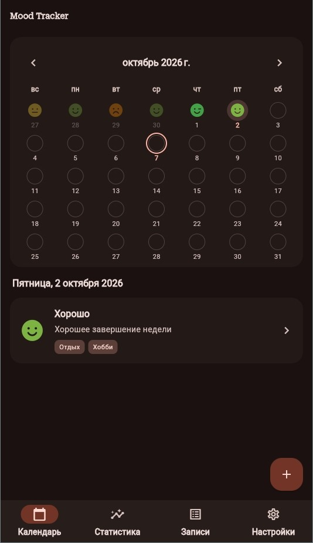
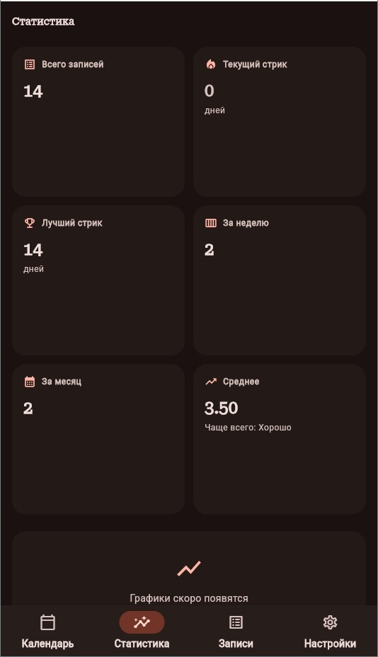
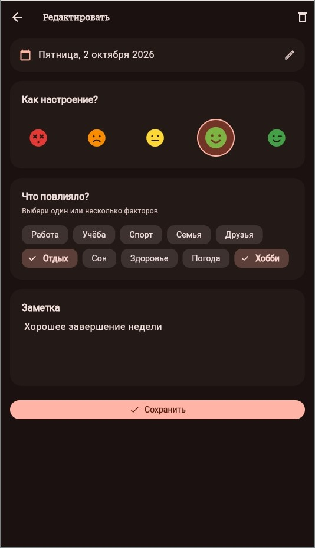
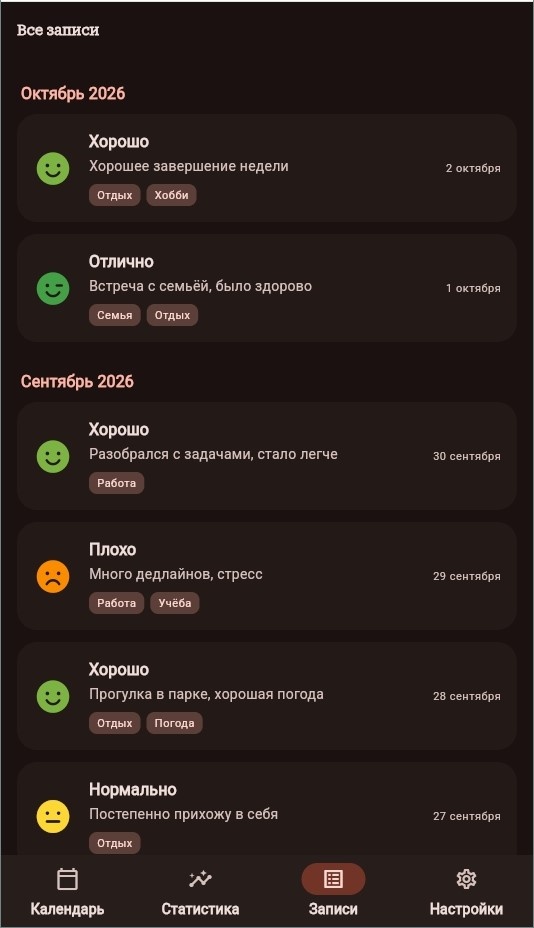
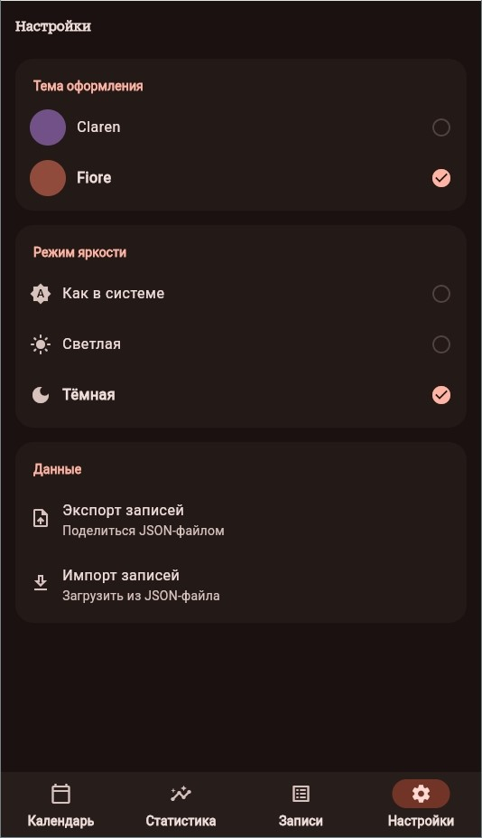

# Mood Tracker

Приложение для ежедневного отслеживания настроения. Записывай, как прошёл день, помечай факторы, которые повлияли, и смотри динамику на календаре и в статистике.

Работает полностью офлайн. Все данные хранятся на устройстве.

---

## Возможности

### Календарь

Главный экран приложения — месячный календарь, где каждая дата с записью отмечена иконкой настроения.

- 5 уровней настроения: от «Ужасно» до «Отлично»
- На датах без записей — пустой кружок
- Выбранный день подсвечен залитым кругом, сегодняшний — обводкой
- Тап по дате показывает запись за этот день
- Тап по пустой дате открывает редактор для создания записи

### Записи

Одна запись в день — так проще вести дневник и анализировать динамику.

- Выбор настроения из 5 уровней с крупными иконками
- Заметка — что повлияло, что запомнилось
- Теги-факторы: Работа, Учёба, Спорт, Семья, Друзья, Отдых, Сон, Здоровье, Погода, Хобби
- Выбор даты через встроенный календарь — можно заполнить пропущенный день задним числом
- При попытке создать вторую запись на ту же дату — диалог «Заменить?»

### Управление записями

- Редактирование любой записи по тапу
- Удаление с подтверждением
- Свайп влево по записи в списке — удаление с возможностью отмены (undo в течение 5 секунд)

### Список всех записей

Отдельная вкладка со всеми записями:

- Группировка по месяцам: «Сентябрь 2026», «Октябрь 2026»
- Внутри — от новых к старым
- Каждая запись: иконка настроения, название уровня, заметка, теги, дата
- Свайп для удаления

### Статистика

Числовые метрики, которые обновляются автоматически:

- **Всего записей** — общее количество
- **Текущий стрик** — сколько дней подряд ведётся дневник
- **Лучший стрик** — самая длинная серия за всё время
- **За неделю** — количество записей за последние 7 дней
- **За месяц** — за текущий календарный месяц
- **Среднее** — средний уровень настроения и самый частый уровень

### Темы оформления

- **Два цветовых пресета:** Claren (лавандово-фиолетовая) и Fiore
- **Три режима яркости:** светлая, тёмная, как в системе
- Переключение мгновенное, выбор сохраняется между запусками
- Единый дизайн Material 3: скруглённые карточки, мягкие тени, аккуратные отступы

### Экспорт и импорт

- **Экспорт** — все записи сохраняются в JSON-файл и отправляются через системный диалог «Поделиться»
- **Импорт** — загрузка записей из JSON-файла, с подтверждением замены текущих данных
- Удобно для переноса между устройствами или резервной копии

### Локализация

- Русский язык интерфейса
- Русские названия месяцев, дней недели, формат дат
- Дата-пикер на русском

---

## Скриншоты

| Календарь | Статистика | Редактор записи |
|:---------:|:----------:|:---------------:|
|  |  |  |

| Список записей | Настройки |
|:--------------:|:---------:|
|  |  |

Записи можно вести каждый день или заполнять пропущенные дни задним числом — статистика учтёт всё.

---